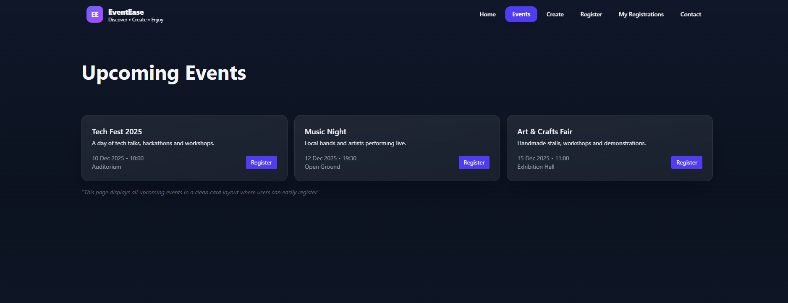
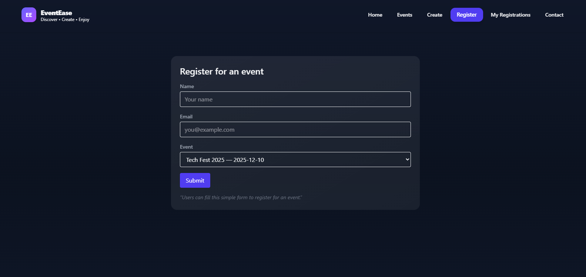

# EventEase 🎉

EventEase is a simple and modern event management UI that allows users to explore events, create event pages, and register easily.  


---

## 🌐 Live Preview

🔗 https://your-live-link-here.vercel.app

---

## 📸 Screenshots

### Homepage


### Events Page


### Create Event


### Registrations


---

## 🛠️ Tech Stack

- **Frontend:** React (Vite)
- **Styling:** CSS / Tailwind CSS
- **Icons:** Lucide / Heroicons
- **Deployment:** Vercel

---

## 📂 Project Structure

```bash
eventease-ui/
├── public/
├── screenshots/
├── src/
│   ├── components/
│   ├── pages/
│   └── assets/
├── README.md
├── index.html
├── package.json
└── vite.config.js
